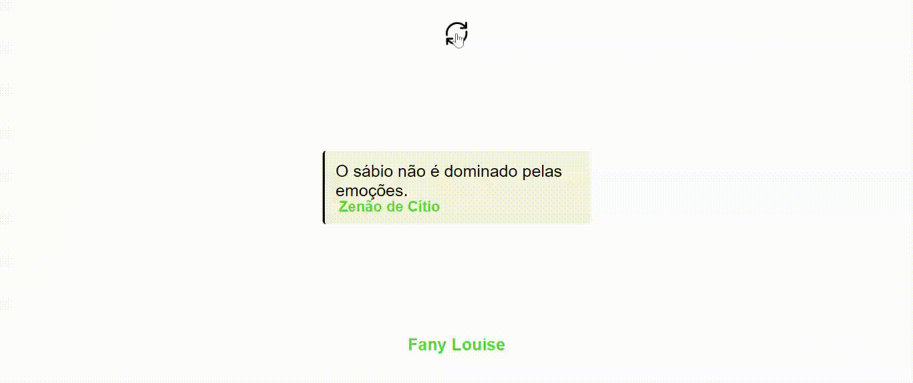

# Dose Estoica

Um gerador de frases estoicas. Inspirado nos principais pensadores estoicos que é uma vertente filosofica que gosto.

Instalação
Ter um editor de códigos como o [VSCode](https://code.visualstudio.com/)

Instalar a extensão: [Live Server](https://marketplace.visualstudio.com/items?itemName=ritwickdey.LiveServer);

Instalar o [NodeJS](https://nodejs.org/en/download);

Instalar através do terminal(CTRL+J) o [JSON-Server](https://www.npmjs.com/package/json-server) com o comando:

npm install -g json-server

Clonar projeto

  git clone [repositorio](https://github.com/fanylouise/dose-estoica.git)
Entre no diretório do projeto

  cd dose-estoica-vanilla
Rodar no terminarl:

json-server --watch db.json

Por Fim: clicar com o botao direito do mouse em cima do arquivo 'index.html' no VSCode e clicar em "Abrir com Live Server".

PS: Juro que estou tentando melhorar isso.

Stack utilizada
**Front-end:**Javascrit,HTML, CSS, Figma, JSON-server

[ChatGPT](https://chat.openai.com/) Foi utilizado para gerar as frases/ To generate phrases.
